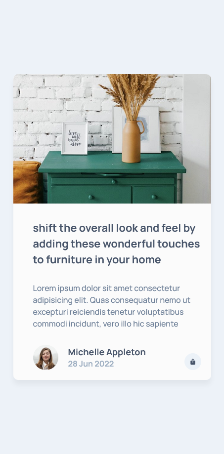

# Article Preview Component

The [Article Preview Component](https://farhdibehnamdev.github.io/Article-Preview-Component/) is designed to practice and explore basic HTML , CSS and JavaScript.

The template is a guide meant for you to explore and change to ✨*make it your own*✨

## Table of contents

- [Overview](#overview)
  - [So how do I use this?](#So-how-do-I-use-this)
  - [The challenge](#the-challenge)
  - [Screenshot](#screenshot)
  - [Links](#links)
- [My process](#my-process)
  - [Built with](#built-with)
  - [helpful resources](#helpful-resources)
- [Created a masterpiece? 🎨 Share it!](#Created-a-masterpiece)

## So how do I use this?

1. Download the files ⬇️
2. Open in a text editor of your choice and change the place holder content to your hearts content 💛
3. Of course, I have used Visual Studio Code.

### The challenge

Users should be able to:

- You can see hover
- You can see responsive design

### Screenshot

### Links

- Live Site URL: [Article Preview Component](https://farhdibehnamdev.github.io/Article-Preview-Component/)

## My process

### Built with

- Semantic HTML5 markup
- Flexbox
- Grid
- JavaScript

## helpful resources

#### Fonts

Family: [Manrope](https://fonts.google.com/specimen/Manrope)

### Colors

- Very Dark Grayish Blue: hsl(217, 19%, 35%)
- Desaturated Dark Blue: hsl(214, 17%, 51%)
- Grayish Blue: hsl(212, 23%, 69%)
- Light Grayish Blue: hsl(210, 46%, 95%)

### Icons

- [Ionicons](https://ionicons.com)

#### CSS

- [Mozilla Developer Network: Beginners Guide to CSS](https://developer.mozilla.org/en-US/docs/Learn/CSS/Introduction_to_CSS)

## Created a masterpiece? 🎨 Share it!

If so, please fork this repo and add a link to this README.md or create an issue with the github page link and to have it added to the README.md.
